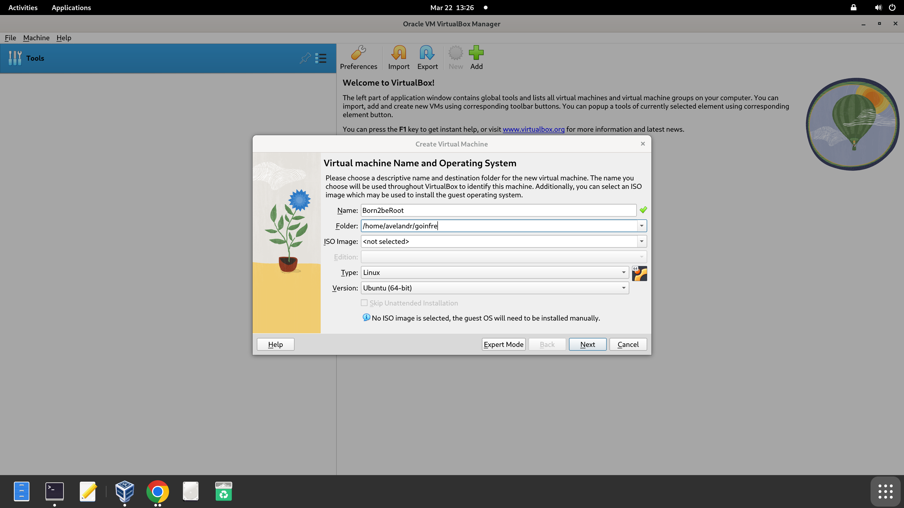
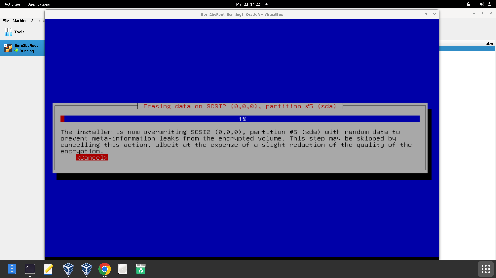

# Paso 1. Crear máquina virtual

Con la opción “New” se ha de crear la máquina virtual de la siguiente forma. Almacenar en la carpeta goinfre, la cual es una carpeta especial de almacenamiento temporal y no respaldado. Se borra periódicamente, como al cerrar sesión, así que se ha de respaldar el proyecto de querer continuar en otra ocasión.

## Configuración Hardware

En este paso se configura la memoria base (RAM) y los procesadores (CPU). La memoria RAM (Random Access Memory) es una memoria temporal que ayuda a no tener que recalcular continuamente la información sino tener la información “a la mano”. El CPU es la Central Process Unit que ejerce la función de ejecutar. Es como el “cerebro” del dispositivo. A más núcleos añadas, más instrucciones se ejecutan simultáneamente.

## Virtual Hard Disk

En este paso se configura un disco duro virtual. Esta unidad es la designada para almacenar la información de forma permanente. Al configurar VirtualBox, se puede configurar dinámicamente.

## Montaje de la imagen ISO

La imagen ISO es el archivo que contiene una copia exacta de todo el contenido de un disco óptico. En este caso, sirve para almacenar todo el sistema operativo que vamos a montar en un solo archivo.

### ¿Qué incluye?

- El núcleo del sistema operativo (el "core" o "kernel")
- Controladores o "drivers"
- Archivos de instalación
- Herramientas para iniciar la instalación

### ¿Para qué sirve?

- Instalar el sistema operativo en un PC
- Probar un sistema en modo "Live" (sin instalarlo)
- Grabar en un USB/DVD para arrancar desde ahí (bootear)
- Recuperar o reparar sistemas operativos dañados

Se ha de navegar desde Settings -> Storage -> Optical Drive donde se ha de añadir la imagen ya descargada de internet.

# Paso 2. Iniciar Máquina Virtual

En la primera pantalla seleccionar “Install” y continuar.

## Configurar el idioma manualmente

Configurar el idioma manualmente, así como la región y país. Es importante que en la pantalla “Configure Keyboard” se elija el inglés americano como predeterminado.

## Configurar host

Tal como dice el subject, se ha de poner como nombre de host el usuario de 42 seguido de “42”.

El domain name queda vacío.

## Configurar usuarios y contraseñas

En esta pantalla se debe ingresar una contraseña para la cuenta que administra el sistema operativo. Después pedirá confirmar la contraseña introducida.

Ahora pide crear un usuario sin permisos administrativos para usar en vez del root. Pondré el mismo tanto para el username como para el apodo. Luego pedirá su respectiva contraseña y su verificación.

# Paso 3. Configurar las particiones

Este paso se realiza para organizar el espacio del disco duro en el servidor. Divide el disco en secciones separadas según su función. En mi caso haré el bonus del subject, por lo que lo haré manual. La siguiente pantalla muestra la descripción de las particiones (que aún no están hechas) y los puntos de montaje. Selecciona el disco generado automáticamente por VirtualBox.

## Llenar tabla de particiones

El subject nos pide crear las particiones de la siguiente forma:

Empezar por el sda1, añadiendo el correspondiente tamaño indicado en “SIZE”, en este caso aproximadamente 500 MB.

### Tipos de particiones:

- **Primaria (Primary)**
  - Es la partición principal del disco
  - Puede haber hasta 4 particiones primarias
  - Desde aquí puedes instalar un sistema operativo
  - Una de ellas puede ser marcada como "activa" para arrancar (boot) el sistema

- **Extendida (Extended)**
  - Es una partición especial que no guarda datos directamente
  - Solo puede haber 1 extendida por disco
  - Sirve para crear particiones lógicas dentro de ella
  - Es como una caja donde puedes meter más compartimentos (particiones lógicas)

- **Lógica (Logical)**
  - Se crean dentro de la partición extendida
  - Puedes tener muchas particiones lógicas (más de 4)
  - Se usan para almacenar datos o instalar sistemas también
  - Ideal cuando necesitas más de 4 particiones y ya usaste las primarias

En este caso hemos de empezar por la primaria, seleccionando en la siguiente pantalla la opción “beginning” para crearla al principio del espacio disponible en el disco.

Modificaremos el punto de montaje (mount point).

En él se ha de seleccionar /boot como punto de arranque de la partición primaria.

### ¿Qué es /boot?

/boot es un directorio del sistema de archivos en sistemas Linux que contiene todos los archivos necesarios para iniciar (bootear) el sistema operativo. Es decir, incluye los componentes esenciales que permiten que el sistema se cargue al encender el equipo.

### ¿Por qué se monta en una partición separada?

Aunque no es obligatorio, a veces se crea una partición exclusiva para /boot por razones como:

- Garantizar que el gestor de arranque pueda acceder fácilmente a los archivos, especialmente en sistemas con cifrado o configuraciones avanzadas.
- Aislar esta parte crítica del sistema para mayor seguridad o facilidad de recuperación.

Con el espacio extra se ha de generar la partición que en el subject aparece como “sda5”. Esta será una partición lógica de tamaño “max”. En el punto de montaje se ha de seleccionar “Do not mount it” porque forman parte de una imagen ISO.

# Paso 4. Configurar volúmenes encriptados

Los volúmenes encriptados son particiones o unidades lógicas cuyos datos están protegidos mediante cifrado. Esto significa que toda la información dentro de ese volumen está codificada de forma que solo puede ser leída si se proporciona la clave correcta.

### ¿Para qué se usan los volúmenes encriptados?

- Proteger datos sensibles: como documentos personales, archivos de trabajo, contraseñas, etc.
- Prevenir el acceso no autorizado: si alguien roba tu disco o USB, no podrá ver la información sin la clave.
- Cumplir políticas de seguridad: en empresas o instituciones que manejan datos confidenciales.

### ¿Cómo funciona a nivel de particiones?

- En el disco, se crea una partición normal, pero en vez de formatearla directamente, se cifra.
- Se usa un sistema de cifrado (como LUKS en Linux).
- Una vez encriptada, se desbloquea con una contraseña durante el arranque o al acceder, y luego se monta como si fuera una partición normal.

Tras esta pantalla, se ha de aceptar el mensaje de confirmación y seleccionar “create encrypted volumes”. Este cifrado se generará en sda5. Tras esto, se selecciona “done setting up the partition” y “finish”. Acto seguido, aceptar el mensaje de confirmación.

Con que nuestra partición está vacía, se puede cancelar este proceso. No hay nada qué cifrar.

En la siguiente pantalla se debe ingresar otra contraseña y confirmarla.

# Paso 5. Configurar el gestor de volumen lógico.

Tras esta pantalla, aceptar el mensaje de confirmación. Ahora empezamos a crear el volume group.

Tal como indica el subject, se ha de llamar “LVMGroup” y almacenarlo en sda5_crypt (la partición que acabamos de cifrar).

Según el bonus del subject:

Es por eso que empezaremos creando el volumen lógico en el grupo que acabamos de crear llamando dicho volumen como “root” con su respectivo SIZE.

Continuar de la misma forma hasta llegar a var-log. Una vez finalizado al seleccionar “display configuration details” se ha de mostrar de esta forma:

Al volver a la pantalla anterior y seleccionar “finish” se accede a la pantalla mostrando dichas particiones y el espacio libre. Ahora se configurará el sitio de montaje para cada una de ellas.

Ext4 sirve para organizar y almacenar archivos en discos duros o particiones en sistemas Linux. Es el sistema de archivos que gestiona cómo se guardan, leen y escriben los datos.

Como punto de montaje se ha de seleccionar “home” y terminar de configurar esta partición. Proceder del mismo modo con las siguientes. Solo para el var/log tiene que ingresar el punto de montaje manualmente y con “swap” el seleccionar “swap area” en vez de ext4.

### ¿Para qué sirve cada partición?

- **/boot**: Contiene los archivos necesarios para arrancar el sistema (kernel, GRUB). No debe estar cifrada para que el sistema pueda iniciar.
- **/root**: Es la raíz del sistema. Aquí se encuentran todos los directorios principales como bin, etc, lib, etc.
- **/home**: Almacena los archivos personales de los usuarios (documentos, configuraciones, descargas).
- **/srv**: Se usa para datos de servicios que el sistema ofrece, como servidores web o FTP.
- **swap**: Espacio en disco usado como memoria virtual cuando se acaba la RAM.
- **/tmp**: Archivos temporales usados por programas y el sistema. Se puede borrar automáticamente al reiniciar.
- **/var**: Archivos que cambian constantemente, como bases de datos, emails o colas de impresión.

Al finalizar, confirmar el mensaje y empezará la barra de instalación. Rechazar la instalación de paquetes adicionales innecesarios.

