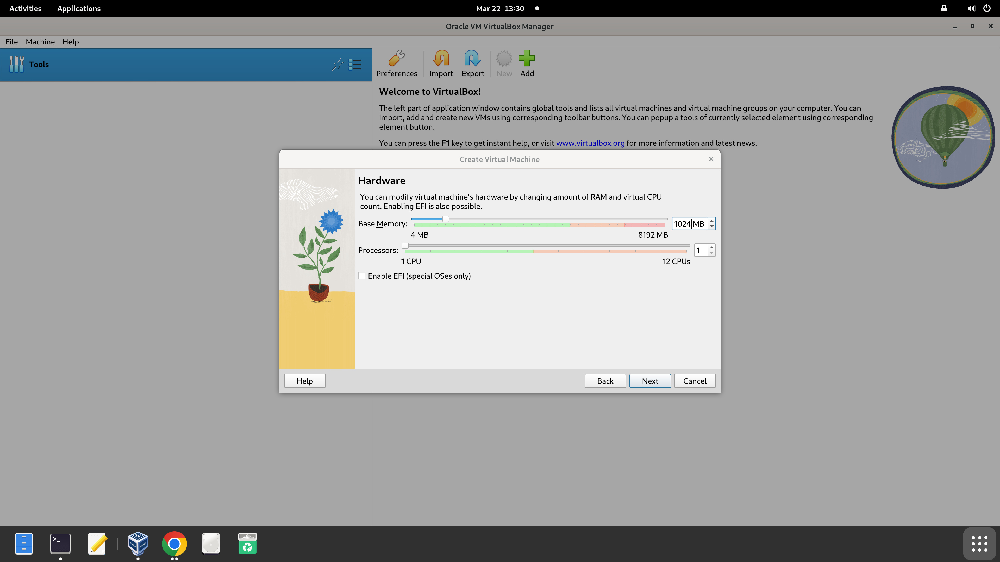

# PASO 1. Crear máquina virtual

Con la opción “New” se ha de crear la máquina virtual de la siguiente forma. Almacenar en 
la carpeta goinfre, la cual es una carpeta especial de almacenamiento temporal y no 
respaldado. Se borra periódicamente, como al cerrar sesión, así que se ha de respaldar el 
proyecto de querer continuar en otra ocasión.

Configuración Hardware

En este paso se configura la memoria base (RAM) y los procesadores (CPU). La memoria 
RAM (Random Access Memory) es una memoria temporal que ayuda a no tener que 
recalcular continuamente la información sino tener la información “a la mano”. El CPU es la 
Central Process Unit que ejerce la función de ejecutar. Es como el “cerebro” del dispositivo. 
A más núcleos añadas, más instrucciones se ejecutan simultáneamente

Virtual Hard Disk

En este paso se configura un disco duro virtual. Esta unidad es la designada para 
almacenar la información de forma permanente. Al configurar VirtualBox, se puede 
configurar dinámicamente

Montaje de la imagen ISO

La imagen ISO es el archivo que contiene una copia exacta de todo el contenido de un 
disco óptico. En este caso, sirve para almacenar todo el sistema operativo que vamos a 
montar en un solo archivo.

¿Qué incluye?

➔ El núcleo del sistema operativo (el "core" o "kernel")  
➔ Controladores o "drivers"  
➔ Archivos de instalación  
➔ Herramientas para iniciar la instalación  

¿Para qué sirve?

➔ Instalar el sistema operativo en un PC  
➔ Probar un sistema en modo "Live" (sin instalarlo)  
➔ Grabar en un USB/DVD para arrancar desde ahí (bootear)  
➔ Recuperar o reparar sistemas operativos dañados  

Se ha de navegar desde Settings -> Storage -> Optical Drive donde se ha de añadir la 
imagen ya descargada de internet

