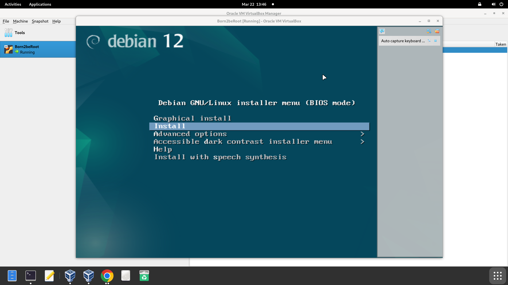
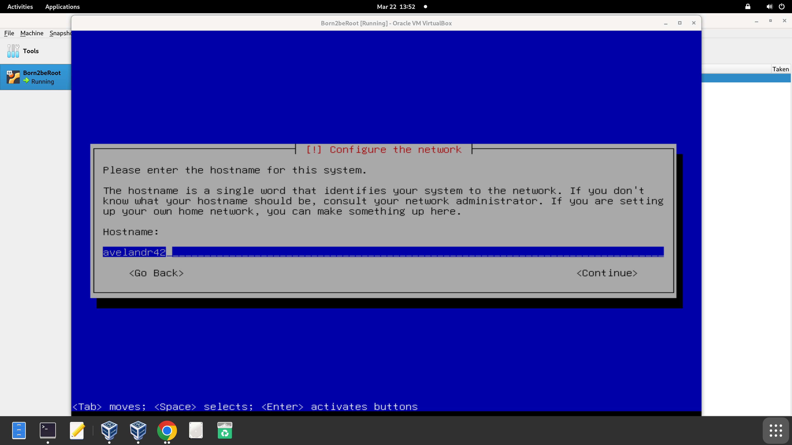

# Paso 2. Iniciar Máquina Virtual

En la primera pantalla seleccionar “Install” y continuar.

## Configurar el idioma manualmente

Configurar el idioma manualmente, así como la región y país. Es importante que en la pantalla “Configure Keyboard” se elija el inglés americano como predeterminado.

## Configurar host

Tal como dice el subject, se ha de poner como nombre de host el usuario de 42 seguido de “42”.

El domain name queda vacío.

## Configurar usuarios y contraseñas

En esta pantalla se debe ingresar una contraseña para la cuenta que administra el sistema operativo. Después pedirá confirmar la contraseña introducida.

Ahora pide crear un usuario sin permisos administrativos para usar en vez del root. Pondré el mismo tanto para el username como para el apodo. Luego pedirá su respectiva contraseña y su verificación.

