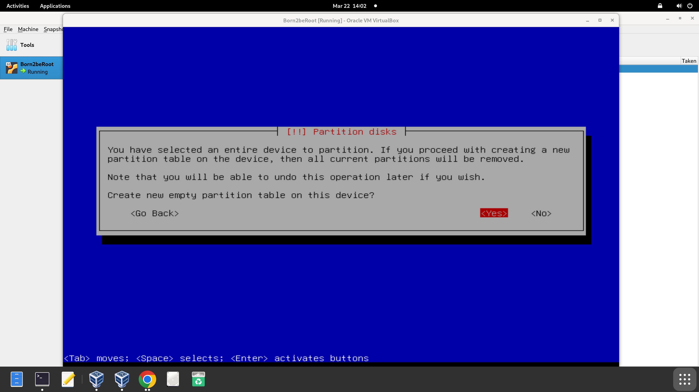
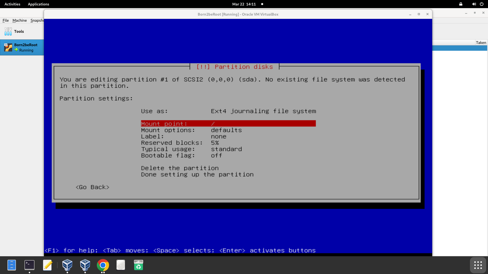
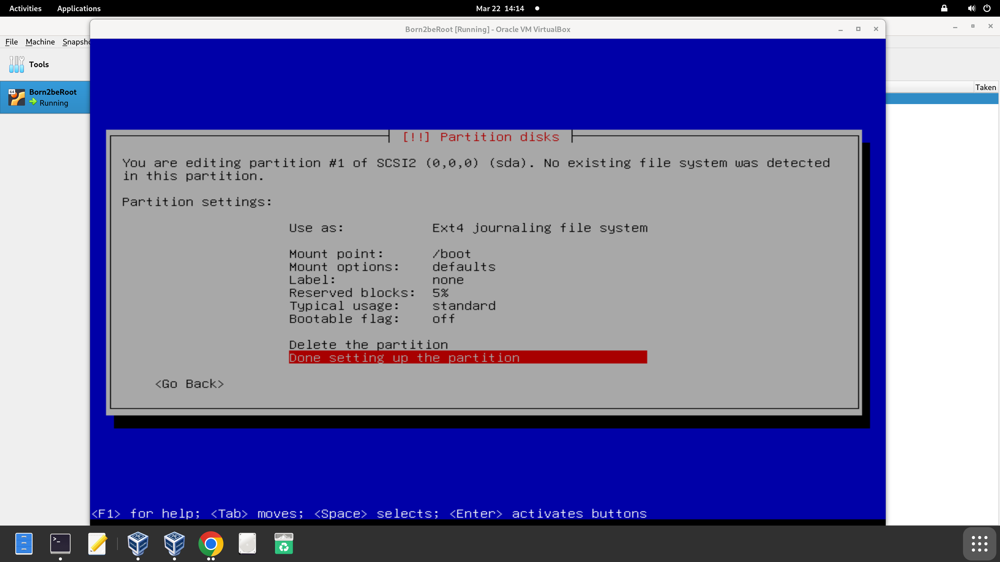

# Paso 3. Configurar las particiones

Este paso se realiza para organizar el espacio del disco duro en el servidor. Divide el disco en secciones separadas según su función. En mi caso haré el bonus del subject, por lo que lo haré manual. La siguiente pantalla muestra la descripción de las particiones (que aún no están hechas) y los puntos de montaje. Selecciona el disco generado automáticamente por VirtualBox.

## Llenar tabla de particiones

El subject nos pide crear las particiones de la siguiente forma:

Empezar por el sda1, añadiendo el correspondiente tamaño indicado en “SIZE”, en este caso aproximadamente 500 MB.

### Tipos de particiones:

- **Primaria (Primary)**
  - Es la partición principal del disco
  - Puede haber hasta 4 particiones primarias
  - Desde aquí puedes instalar un sistema operativo
  - Una de ellas puede ser marcada como "activa" para arrancar (boot) el sistema

- **Extendida (Extended)**
  - Es una partición especial que no guarda datos directamente
  - Solo puede haber 1 extendida por disco
  - Sirve para crear particiones lógicas dentro de ella
  - Es como una caja donde puedes meter más compartimentos (particiones lógicas)

- **Lógica (Logical)**
  - Se crean dentro de la partición extendida
  - Puedes tener muchas particiones lógicas (más de 4)
  - Se usan para almacenar datos o instalar sistemas también
  - Ideal cuando necesitas más de 4 particiones y ya usaste las primarias

En este caso hemos de empezar por la primaria, seleccionando en la siguiente pantalla la opción “beginning” para crearla al principio del espacio disponible en el disco.

Modificaremos el punto de montaje (mount point).

En él se ha de seleccionar /boot como punto de arranque de la partición primaria.

### ¿Qué es /boot?

/boot es un directorio del sistema de archivos en sistemas Linux que contiene todos los archivos necesarios para iniciar (bootear) el sistema operativo. Es decir, incluye los componentes esenciales que permiten que el sistema se cargue al encender el equipo.

### ¿Por qué se monta en una partición separada?

Aunque no es obligatorio, a veces se crea una partición exclusiva para /boot por razones como:

- Garantizar que el gestor de arranque pueda acceder fácilmente a los archivos, especialmente en sistemas con cifrado o configuraciones avanzadas.
- Aislar esta parte crítica del sistema para mayor seguridad o facilidad de recuperación.

Con el espacio extra se ha de generar la partición que en el subject aparece como “sda5”. Esta será una partición lógica de tamaño “max”. En el punto de montaje se ha de seleccionar “Do not mount it” porque forman parte de una imagen ISO.

