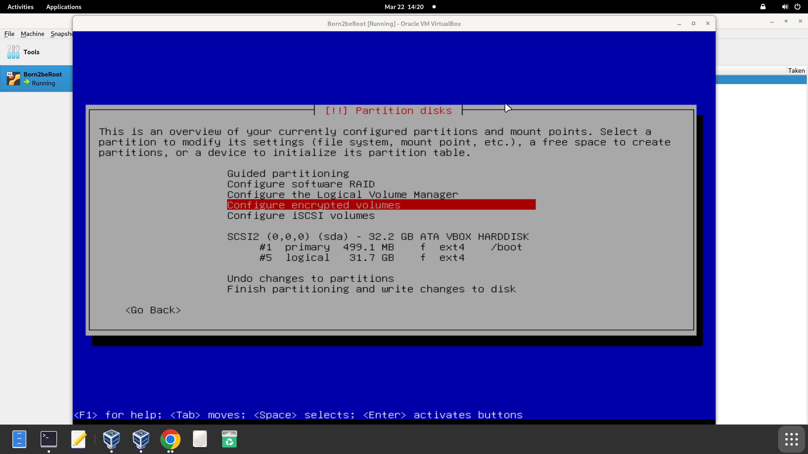

# Paso 4. Configurar volúmenes encriptados

Los volúmenes encriptados son particiones o unidades lógicas cuyos datos están protegidos mediante cifrado. Esto significa que toda la información dentro de ese volumen está codificada de forma que solo puede ser leída si se proporciona la clave correcta.

### ¿Para qué se usan los volúmenes encriptados?

- Proteger datos sensibles: como documentos personales, archivos de trabajo, contraseñas, etc.
- Prevenir el acceso no autorizado: si alguien roba tu disco o USB, no podrá ver la información sin la clave.
- Cumplir políticas de seguridad: en empresas o instituciones que manejan datos confidenciales.

### ¿Cómo funciona a nivel de particiones?

- En el disco, se crea una partición normal, pero en vez de formatearla directamente, se cifra.
- Se usa un sistema de cifrado (como LUKS en Linux).
- Una vez encriptada, se desbloquea con una contraseña durante el arranque o al acceder, y luego se monta como si fuera una partición normal.

Tras esta pantalla, se ha de aceptar el mensaje de confirmación y seleccionar “create encrypted volumes”. Este cifrado se generará en sda5. Tras esto, se selecciona “done setting up the partition” y “finish”. Acto seguido, aceptar el mensaje de confirmación.

Con que nuestra partición está vacía, se puede cancelar este proceso. No hay nada qué cifrar.

En la siguiente pantalla se debe ingresar otra contraseña y confirmarla.
