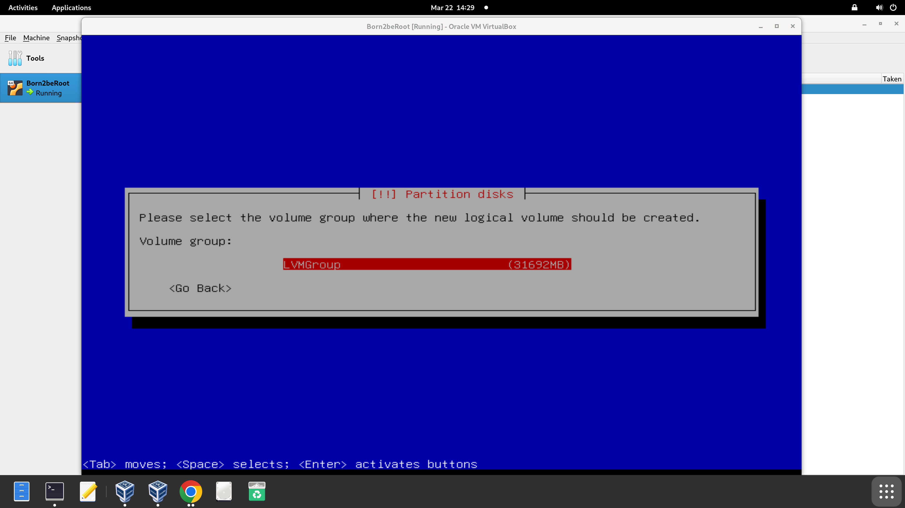

# Paso 5. Configurar el gestor de volumen lógico.


Tras esta pantalla, aceptar el mensaje de confirmación. Ahora empezamos a crear el volume group.


Tal como indica el subject, se ha de llamar “LVMGroup” y almacenarlo en sda5_crypt (la partición que acabamos de cifrar).

Según el bonus del subject:


Es por eso que empezaremos creando el volumen lógico en el grupo que acabamos de crear llamando dicho volumen como “root” con su respectivo SIZE.



Continuar de la misma forma hasta llegar a var-log. Una vez finalizado al seleccionar “display configuration details” se ha de mostrar de esta forma:


Al volver a la pantalla anterior y seleccionar “finish” se accede a la pantalla mostrando dichas particiones y el espacio libre. Ahora se configurará el sitio de montaje para cada una de ellas.


Ext4 sirve para organizar y almacenar archivos en discos duros o particiones en sistemas Linux. Es el sistema de archivos que gestiona cómo se guardan, leen y escriben los datos.


Como punto de montaje se ha de seleccionar “home” y terminar de configurar esta partición. Proceder del mismo modo con las siguientes. Solo para el var/log tiene que ingresar el punto de montaje manualmente y con “swap” el seleccionar “swap area” en vez de ext4.


### ¿Para qué sirve cada partición?

- **/boot**: Contiene los archivos necesarios para arrancar el sistema (kernel, GRUB). No debe estar cifrada para que el sistema pueda iniciar.
- **/root**: Es la raíz del sistema. Aquí se encuentran todos los directorios principales como bin, etc, lib, etc.
- **/home**: Almacena los archivos personales de los usuarios (documentos, configuraciones, descargas).
- **/srv**: Se usa para datos de servicios que el sistema ofrece, como servidores web o FTP.
- **swap**: Espacio en disco usado como memoria virtual cuando se acaba la RAM.
- **/tmp**: Archivos temporales usados por programas y el sistema. Se puede borrar automáticamente al reiniciar.
- **/var**: Archivos que cambian constantemente, como bases de datos, emails o colas de impresión.

Al finalizar, confirmar el mensaje y empezará la barra de instalación. Rechazar la instalación de paquetes adicionales innecesarios.


Configurar el manager de paquetes

Luego de la espera, seleccionar el país apropiado y el archive mirror apropiado, que en general suele ser deb.debian.org.


La pantalla del proxy HTTP va vacía


A mí me apareció esta pantalla. No es grave si estás haciendo una instalación de prueba o aprendizaje. Simplemente no tendrás actualizaciones de seguridad al momento de instalar, pero puedes configurarlo después con:

```sh
sudo apt update
```
```sh
sudo apt upgrade
```


Tras esto, comenzará a instalarse el software necesario :)
